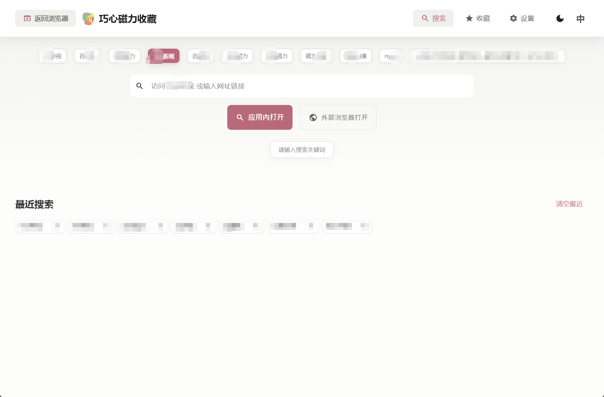
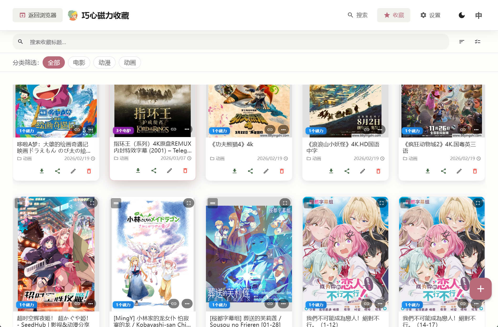
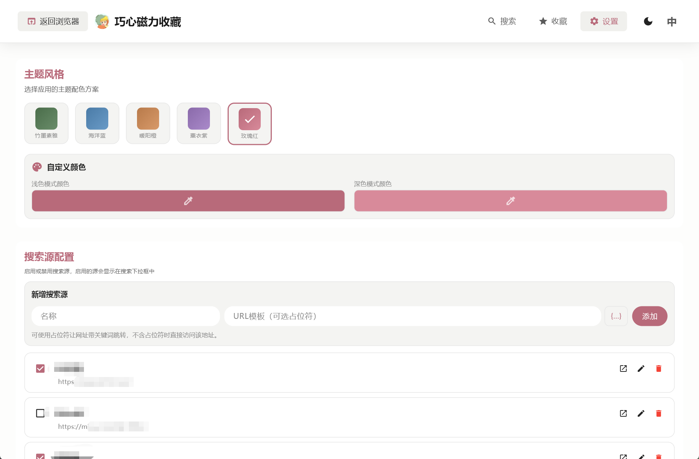
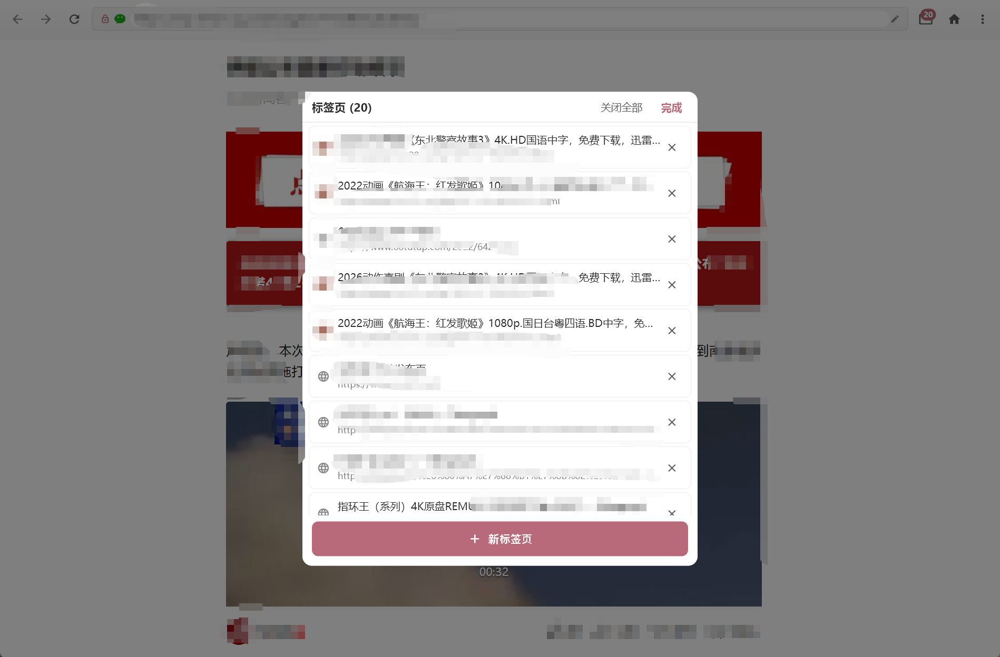
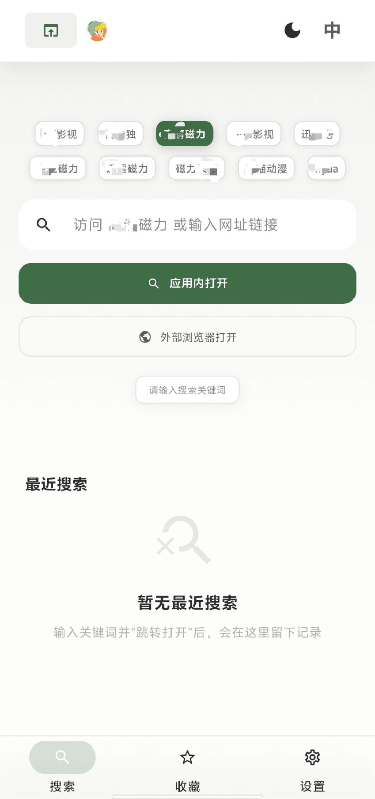
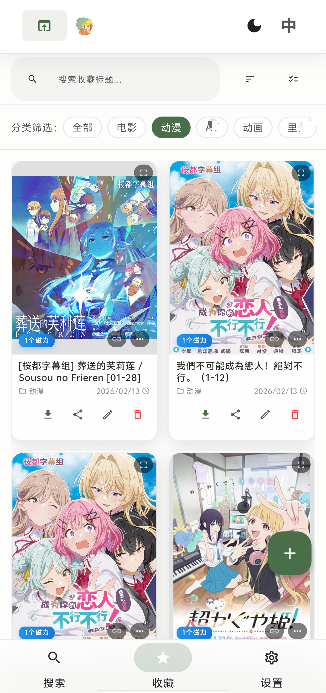
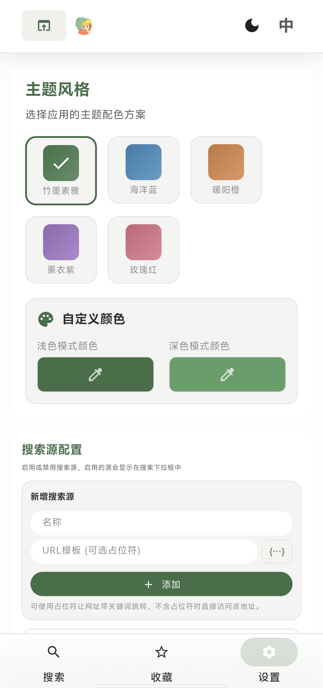
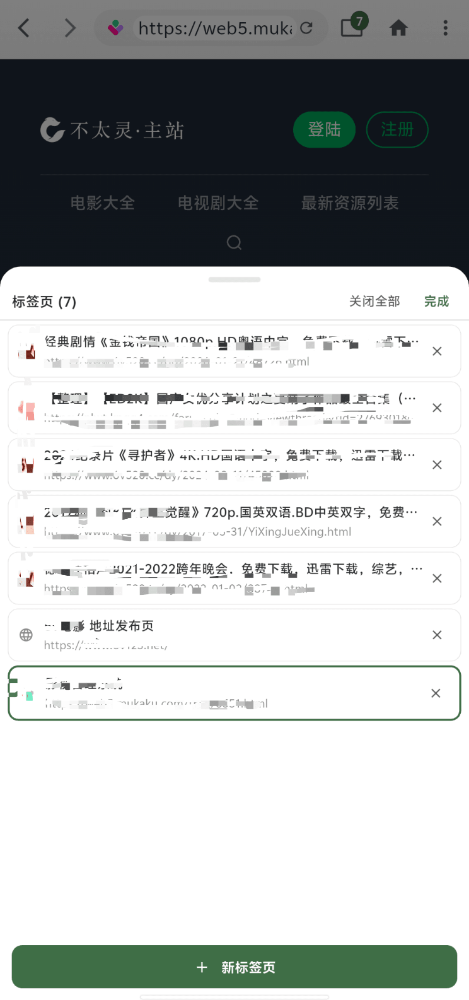

#  巧心磁力收藏 Ciallo～(∠・ω< )⌒★

**本地磁力/电驴资源收藏管理工具**

🔒 一款专注于隐私保护的磁力/电驴链接管理软件

  
  
  

  <a href="./README.md">中文</a> | <a href="./README_EN.md">English</a>

---

## 📖 软件简介

**巧心磁力收藏** 是一款轻量级的磁力链接和电驴链接收藏管理工具。所有数据完全本地存储，不上传任何用户信息，保护您的隐私安全。如果软件受欢迎的话，我会考虑开源。

---

## ✨ 主要功能

### 🔍 搜索与收藏
- 支持自定义搜索源，快速查找资源
- 一键收藏磁力/电驴链接
- 保存最近搜索记录

### 📂 分类管理
- 灵活的分类系统，支持创建、重命名、删除、隐藏
- 批量操作：多选、批量删除、批量移动、批量分享
- 支持手动排序、按时间排序、按名称排序

### 🖼️ 封面管理
- 支持本地上传封面图片
- 在线搜索封面图片
- 智能图片检测

### 🌐 内嵌浏览器
- 内置浏览器，无需切换应用
- 自动检测页面中的磁力链接和电驴链接
- 广告拦截功能
- 标签页管理
- 设置页面支持设为默认浏览器，方便快速抓取页面中的磁力/电驴链接

### 🔗 一键打开
- 支持一键调用系统已安装的第三方应用
- 支持打开：迅雷、115网盘等支持磁力链接及电驴的应用
- 支持打开各类在线播放磁力软件
- 支持标记已下载功能，已下载或空收藏则快速复制名称，快速检索

### 💾 数据备份
- JSON格式导入导出
- 局域网传输备份文件
- 备份管理：重命名、删除、标记重要
- 差异对比功能

### 🎨 个性化设置
- 深色/浅色模式切换
- 多种预设主题风格
- 自定义主题颜色
- 支持中文/英文切换

---

## 📥 下载安装

### 💻 Windows/Android 版本

前往 [Releases](https://github.com/clever-heart/clever-heart-magnetic/releases/) 页面下载最新版本的安装包。

### 📋 系统要求

- 🪟 Windows 10 或更高版本
- 🤖 Android 5.0 或更高版本

> 📌 **注意**: 目前仅支持 Windows 和 Android 平台

---

## 🖼️ 应用截图

### 💻 Windows 平台

| Windows-页面1-搜索首页 | Windows-页面2-收藏管理 |
|:---:|:---:|
|  |  |

| Windows-页面3-设置 | Windows-页面4-网页浏览 |
|:---:|:---:|
|  |  |

### 📱 Android 平台

| Android-页面1-搜索首页 | Android-页面2-收藏管理 |
|:---:|:---:|
|  |  |

| Android-页面3-设置 | Android-页面4-网页浏览 |
|:---:|:---:|
|  |  |

---

## 📚 使用说明

### 🚀 首次使用

1. 下载并安装软件
2. 打开软件，开始添加您的第一个收藏
3. 在设置中配置搜索源和封面源

### ➕ 添加收藏

**方式一：手动添加**
1. 点击右下角的"+"按钮
2. 输入磁力链接或电驴链接
3. 填写标题、选择分类
4. 可选：添加封面图片

**方式二：从浏览器添加**
1. 打开内置浏览器
2. 访问资源网站
3. 软件会自动检测页面中的磁力/电驴链接
4. 点击链接即可快速收藏

### 🔄 数据备份与恢复

**备份数据**
1. 进入设置 -> 数据备份
2. 点击"导出备份"
3. 选择保存位置

**恢复数据**
1. 进入设置 -> 数据备份
2. 点击"导入备份"
3. 选择备份文件

**局域网传输**
1. 在发送设备上：设置 -> 数据备份 -> 局域网传输 -> 发送
2. 在接收设备上：设置 -> 数据备份 -> 局域网传输 -> 接收
3. 扫描二维码或输入地址完成传输

---

## ❓ 常见问题

### Q: 数据存储在哪里？
A: 所有数据完全存储在您的本地设备上，不会上传到任何服务器。

### Q: 如何更换设备？
A: 使用数据备份功能导出备份文件，然后在新设备上导入即可。

### Q: 支持哪些链接格式？
A: 支持磁力链接（magnet:?xt=...）和电驴链接（ed2k://...）。

### Q: 如何添加自定义搜索源？
A: 进入设置 -> 搜索源管理，点击添加按钮，输入搜索源名称和URL模板。

---

## 🔐 隐私声明

- ✅ 所有数据完全本地存储，不上传任何用户信息
- ✅ 不收集任何用户行为数据
- ✅ 不包含任何第三方统计SDK
- ✅ 网络请求仅用于搜索和获取封面图片

---

## 👤 联系作者

**B站：咕噜咕噜大法师**

如有问题或建议，欢迎在B站或当前站点私信联系我。

---

## 📝 更新日志

### v1.0.1
- 🐛 版本优化：统一版本号管理
- 🔧 配置改进：准备后续动态版本获取优化

### v1.0.0
- 🎉 首次发布
- ✨ 支持磁力/电驴链接收藏管理
- 📂 支持分类管理
- 💾 支持数据备份与恢复
- 📡 支持局域网传输
- 🌍 支持多语言（中文/英文）

---

**如果这个软件对你有帮助，请给一个 ⭐ Star 支持一下！**

Made with ❤️ by 咕噜咕噜大法师

