

#  巧心磁力收藏 Ciallo～(∠・ω< )⌒★

**本地磁力/电驴资源收藏管理工具**

🔒 一款专注于隐私保护的磁力/电驴链接管理软件

QQ交流群：629077739

  
  
  

  <a href="./README.md">中文</a> | <a href="./README_EN.md">English</a>

---

## 📖 软件简介

**巧心磁力收藏** 是一款轻量级的磁力链接和电驴链接收藏管理工具。所有数据完全本地存储，不上传任何用户信息，保护您的隐私安全。如果软件受欢迎的话，我会考虑开源。

---

## ✨ 主要功能

### 🔍 搜索与收藏
- 支持自定义搜索源（支持 GET 链接配置），快速查找资源
- 顶部模式切换（订阅源 / 本地），探索源可视化管理
- 一键收藏磁力/电驴链接
- 保存最近搜索记录

### 📂 分类管理
- 灵活的分类系统，支持创建、重命名、删除、隐藏
- 批量操作：多选、批量删除、批量移动、批量分享
- 支持手动排序、按时间排序、按名称排序

### 🎬 在线播放
- 支持 VOD 和 P2P 两种播放模式
- 自动解析磁力链接文件列表，多文件选择播放
- 播放器支持：字幕搜索与设置、截图保存、续播、音轨/字幕轨道切换、画面调节（亮度/对比度/饱和度）、锁屏模式
- 支持外部播放：Android 调起系统播放器、桌面端复制播放链接
- VOD/P2P 模式自动记忆上次选择

### 📥 下载管理
- 磁力链接多文件选择下载（仅视频和音频文件）
- 下载任务卡片展示（合集头部 + 子文件结构）
- 支持暂停/恢复/删除下载任务
- 子文件独立进度和网速显示
- 视频首帧缩略图提取

### ☁️ 115 网盘
- 登录后直接在软件内浏览网盘文件，视频支持原画在线播放（保留内封字幕）
- 网盘资源一键离线下载到 115，远程跑下载不占本机带宽
- 网盘文件与本地下载 / 播放记录打通，统一查看进度与续播
- 文件管理：重命名、图片预览、逐级返回，并支持从本地跳回网盘所在目录

### 📜 播放历史
- 自动记录播放进度，再次打开可续播
- 封面自动获取（优先使用收藏封面）
- 支持多选删除播放记录

### ️ 封面管理
- 支持本地上传封面图片
- 在线搜索封面图片
- 智能图片检测
- saveBase64 开关：保存网络封面为 Base64，离线也可显示
- 网络图片磁盘缓存

### 🌐 内嵌浏览器
- 内置浏览器，无需切换应用
- 自动检测页面中的磁力链接和电驴链接
- 广告拦截功能
- 标签页管理
- 设置页面支持设为默认浏览器，方便快速抓取页面中的磁力/电驴链接
- 浏览历史：自动记录访问的网页，快速回到近期页面

### 🔗 一键打开
- 支持一键调用系统已安装的第三方应用
- 支持打开：迅雷、115网盘等支持磁力链接及电驴的应用
- 支持打开各类在线播放磁力软件
- 支持标记已下载功能，已下载或空收藏则快速复制名称，快速到其他应用检索

### 💾 数据备份
- JSON格式导入导出
- 局域网传输备份文件
- 备份管理：重命名、删除、标记重要
- 差异对比功能

### 🎨 个性化设置
- 深色/浅色模式切换
- 多种预设主题风格
- 自定义主题颜色、网络图片壁纸背景
- 支持中文/英文切换

---

## 📥 下载安装

### 💻 Windows/Android 版本

前往 [Releases](https://github.com/clever-heart/clever-heart-magnetic/releases/) 页面下载最新版本的安装包。

### 📋 系统要求

- 🪟 Windows 10 或更高版本
- 🤖 Android 5.0 或更高版本

> 📌 **注意**: 目前仅支持 Windows 和 Android 平台

---

## 🖼️ 应用截图

### 💻 Windows 平台

|                                              Windows-探索首页                                               | Windows-收藏管理 |
|:-------------------------------------------------------------------------------------------------------:|:---:|
|  | 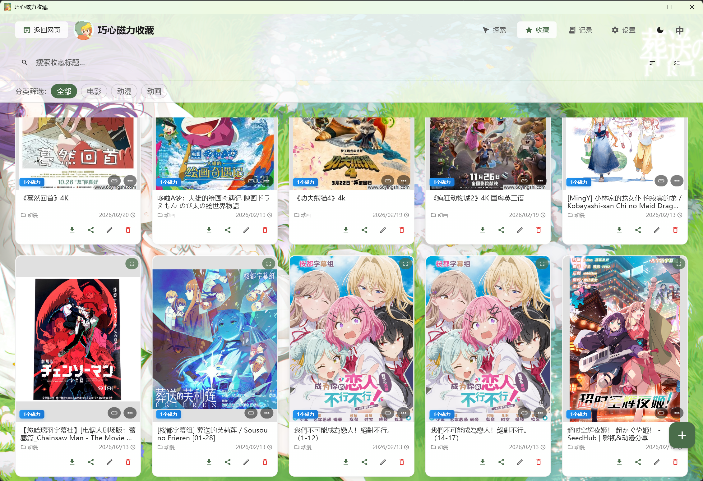 |

|                                              Windows-记录管理                                               |                                              Windows-设置页面                                               |
|:-------------------------------------------------------------------------------------------------------:|:-------------------------------------------------------------------------------------------------------:|
|  | 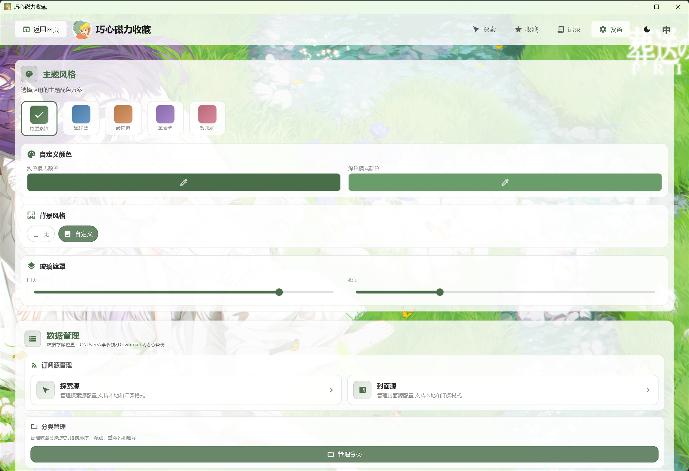 |

|                                              Windows-在线播放                                               |                                              Windows-下载管理                                               |
|:-------------------------------------------------------------------------------------------------------:|:-------------------------------------------------------------------------------------------------------:|
| 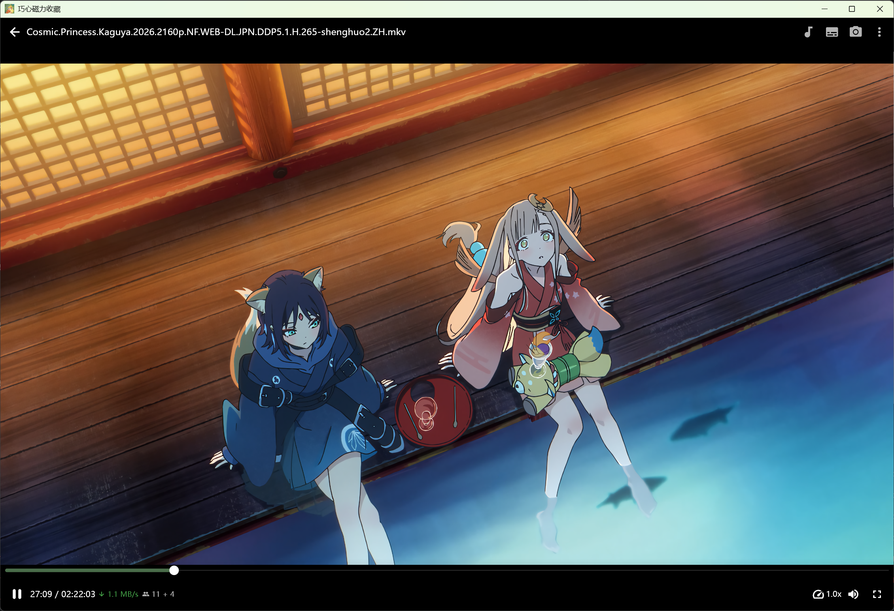 |  |

|                                              Windows-网盘文件浏览                                               |                                              Windows-离线任务管理                                               |
|:-------------------------------------------------------------------------------------------------------:|:-------------------------------------------------------------------------------------------------------:|
| 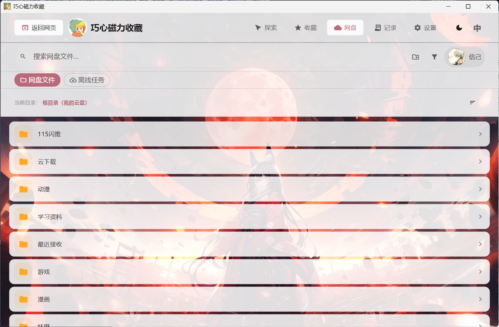 | 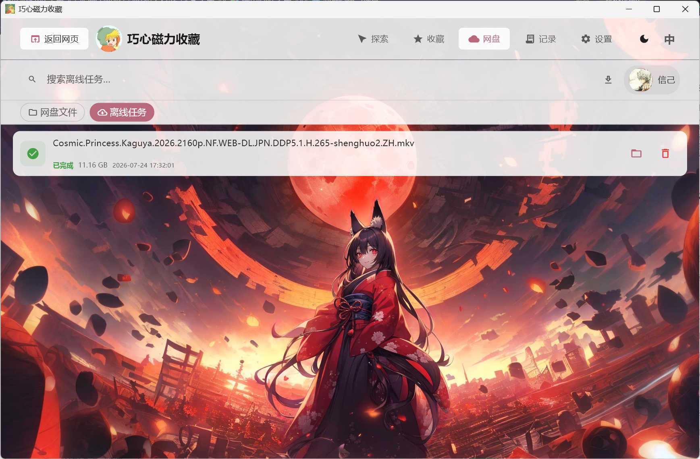 |

### 📱 Android 平台

|                                             Android-探索首页                                              | Android-收藏管理 |
|:-----------------------------------------------------------------------------------------------------:|:---:|
| 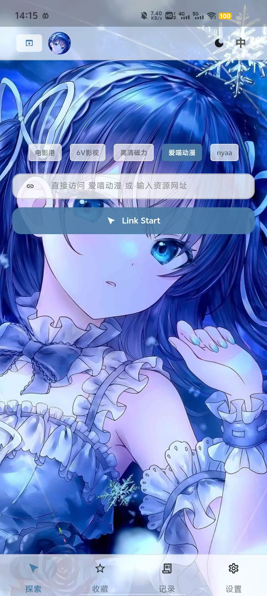 | 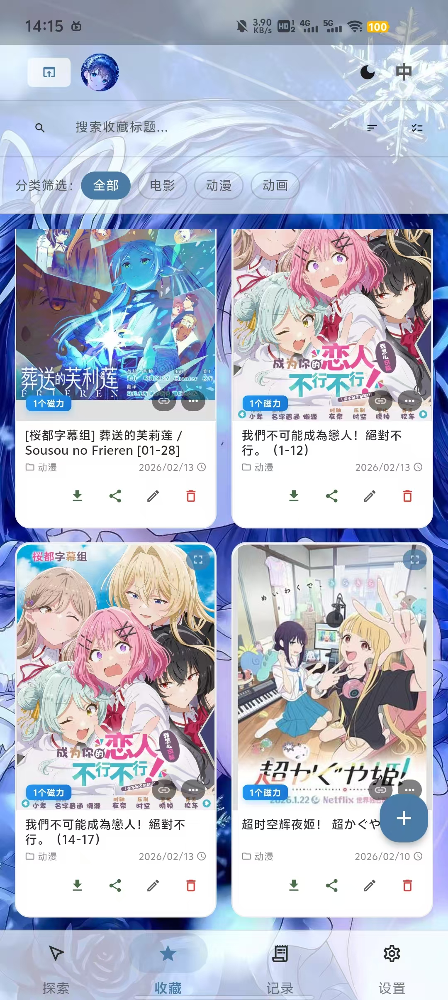 |

|                                              Android-设置                                               |                                             Android-网页浏览                                              |
|:-----------------------------------------------------------------------------------------------------:|:-----------------------------------------------------------------------------------------------------:|
| 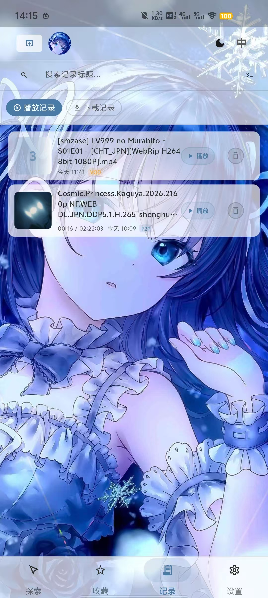 | 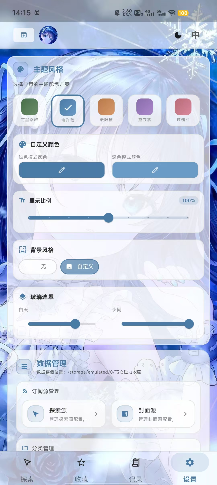 |

|                                             Android-在线播放                                              | Android-下载管理 |
|:-----------------------------------------------------------------------------------------------------:|:---:|
|  | 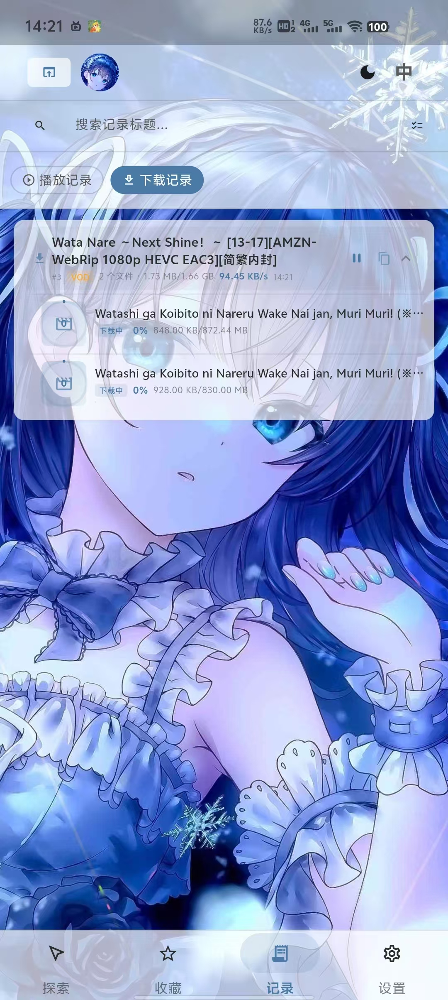 |

|                                              Android-网盘文件浏览                                               |                                              Android-离线任务管理                                               |
|:-------------------------------------------------------------------------------------------------------:|:-------------------------------------------------------------------------------------------------------:|
| 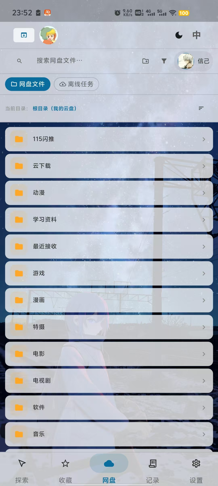 | 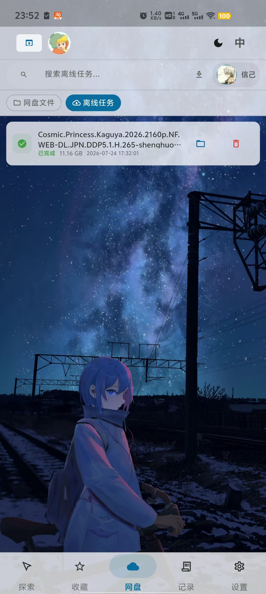 |

---

## 📚 使用说明

### 🚀 首次使用

1. 下载并安装软件
2. 打开软件，开始添加您的第一个收藏
3. 在设置中配置搜索源和封面源

### ➕ 添加收藏

**方式一：手动添加**
1. 点击右下角的"+"按钮
2. 输入磁力链接或电驴链接
3. 填写标题、选择分类
4. 可选：添加封面图片

**方式二：从浏览器添加**
1. 打开内置浏览器
2. 访问资源网站
3. 软件会自动检测页面中的磁力/电驴链接
4. 点击链接即可快速收藏

### 🎬 在线播放

1. 在搜索结果或收藏列表中点击磁力链接，弹出资源解析页面
2. 选择要播放的文件，点击播放按钮
3. Android 可选择 VOD 或 P2P 模式，桌面端仅支持 P2P 模式
4. 播放中点击屏幕呼出控制栏：截图、字幕设置、画面调节、音轨/字幕切换、锁屏
5. 退出后再次打开同一资源可续播

### ⬇️ 下载管理

1. 在资源解析页面选择要下载的文件（仅视频和音频文件可下载），点击下载按钮
2. 下载任务卡片显示在下载管理页面，点击展开查看子文件详情
3. 支持暂停/恢复/删除操作
4. Android 通知栏可查看下载进度

### 🔄 数据备份与恢复

**备份数据**
1. 进入设置 -> 数据备份
2. 点击"导出备份"
3. 选择保存位置

**恢复数据**
1. 进入设置 -> 数据备份
2. 点击"导入备份"
3. 选择备份文件

**局域网传输**
1. 在发送设备上：设置 -> 数据备份 -> 局域网传输 -> 发送
2. 在接收设备上：设置 -> 数据备份 -> 局域网传输 -> 接收
3. 扫描二维码或输入地址完成传输

---

## ❓ 常见问题

### Q: 数据存储在哪里？
A: 所有数据完全存储在您的本地设备上，不会上传到任何服务器。

### Q: 如何更换设备？
A: 使用数据备份功能导出备份文件，然后在新设备上导入即可。

### Q: 支持哪些链接格式？
A: 支持磁力链接（magnet:?xt=...）和电驴链接（ed2k://...）。

### Q: 如何添加自定义搜索源？
A: 进入设置 -> 搜索源管理，点击添加按钮，输入搜索源名称和URL模板。

### Q: VOD 和 P2P 模式有什么区别？
A: VOD模式仅Android可用，下载速度快；P2P 模式全平台可用，无需第三方SDK。上次选择的模式会被自动记忆。

---

## 🔐 隐私声明

- ✅ 所有数据完全本地存储，不上传任何用户信息
- ✅ 不收集任何用户行为数据
- ✅ 网络请求仅用于搜索和获取封面图片

---

## 👤 联系作者

**B站：咕噜咕噜大法师**

如有问题或建议，欢迎在B站或当前站点私信联系我。

---

## 📝 更新日志

### v1.0.7
- ✨ 新增：DLNA 投屏功能，支持 P2P/VOD/115/本地文件四种模式投屏到电视
- ✨ 新增：磁力收藏订阅式更新检测 — 回访来源页发现新增磁力后红标提示，支持勾选合并；可逐条控制是否参与检测
- ✨ 新增：字幕搜索与挂载交互重构 — 合并字幕弹窗为顶部 Tab 切换（字幕轨道/在线搜索），支持更多在线字幕源
- ✨ 新增：115 智能命名弹窗，文件名无损分块重写；推送目录弹窗新增收藏选项与标记已下载
- 🎨 优化：网页导航栏显示标题，输入框与更多菜单精简
- 🎨 优化：播放器 UI 重构，换集过程静音消除异响

### v1.0.6
- ✨ 新增：115 网盘上传图片/封面，上传成功可跳转到目录；目录选择器支持新建文件夹
- ✨ 新增：通用搜索历史下拉 — 探索、收藏、115、记录、新标签页均支持搜索历史快速复用
- ✨ 新增：播放模式切换 — 顺序播放 / 随机播放，倍速上限扩展到 5x 并记忆上次选择
- ✨ 新增：磁力解析顶栏复制磁力链接图标、磁力对话框注入种子名按钮
- ✨ 新增：图片网格 4:3 竖向布局
- 🎨 优化：播放器消除进度条/秒数闪烁、卡顿修复、选集/横屏/自动下一集等优化
- 🎨 优化：播放器退出前静音消除异步释放回声、初始化前加载屏统一显示网速/peers
- 🎨 优化：115 文件类型筛选支持多选、网盘图片预览路径记忆（返回回到相册列表）
- 🎨 优化：115 跳回目录锚点定位、翻页死循环修复
- 🐛 修复：VOD 首播/选集卡死（等子文件起量再返回 proxy URL）
- 🐛 修复：播放记录封面仅用退出/换集截图（移除 whatslink 覆盖与首帧截图）、稀疏文件进度误判
- 🐛 修复：media_kit 伪轨道过滤、多项代码审计缺陷（P0-P3）

### v1.0.5
- ✨ 新增：115 网盘接入 — 登录后直接在软件内浏览网盘、视频原画在线播放（保留内封字幕），网盘资源可一键离线下载
- ✨ 新增：网盘与本地打通 — 115 文件并入下载 / 播放记录统一管理，支持从本地跳回网盘所在目录；文件可重命名、多图预览、逐级返回
- ✨ 新增：网络图片壁纸背景 — 一键设置在线图片为应用背景
- ✨ 新增：搜索顶部模式切换栏（订阅源 / 本地），探索源支持 GET 链接配置搜索，管理更直观
- ✨ 新增：播放器外部播放 — Android 调起系统播放器、桌面端复制播放链接
- ✨ 新增：下载记录页 115 树形结构 + 断点续传，下载任务样式统一
- ✨ 新增：浏览历史记录，快速回到近期访问页面
- 🎨 优化：播放器续播落位更稳定、倍速选择记忆上次、MPV 日志级别跟随偏好、进度统计更精准
- 🎨 优化：WebView 封面 / 背景拾取体验（复用已解码字节、移除点图即选）
- 🎨 优化：115 错误提示友好化、会话过期统一重登（仅弹一次）
- 🐛 修复：Android 10 存储权限兼容、字幕 403、登录不持久化等若干问题

### v1.0.4
- ✨ 新增：磁力在线播放 — VOD（仅Android）和 P2P（全平台）两种模式，支持多文件选择播放
- ✨ 新增：播放器 — 字幕搜索/设置、截图、续播、音轨/字幕切换、画面调节（亮度/对比度/饱和度/超分辨率）、锁屏
- ✨ 新增：下载管理 — 多文件选择下载，任务卡片（合集+子文件），暂停/恢复/删除，独立进度
- ✨ 新增：播放历史 — 自动记录进度与续播，封面自动获取，多选删除
- ✨ 新增：封面管理增强 — saveBase64 开关、网络图片磁盘缓存
- ✨ 新增：Android 通知栏 — 播放进度/下载详情，VOD/P2P 模式标签
- ✨ 新增：桌面端系统托盘 — 最小化到托盘、关闭确认、ESC 返回
- ✨ 新增：更新日志 Markdown 渲染与图片显示
- 🎨 优化：Tracker CDN 镜像、磁力解析全屏页面、局域网 LAN 发现
- 🐛 修复：字幕设置/轨道同步、P2P 假完成、空输入崩溃、Android Release 崩溃

### v1.0.3
- ✨ 新增：头像上传和裁剪功能
- ✨ 新增：全平台图片裁剪功能
- ✨ 新增：配置管理系统（本地+订阅源模式）
- ✨ 新增：URL 导入配置
- ✨ 新增：全局缩放支持（80%-120%）
- ✨ 新增：探索页面 UI 优化
- ✨ 新增：收藏页排序（随机排序+透明度）
- ✨ 新增：资源列表（类型标签+大小+自动打开）
- ✨ 新增：磁力/电驴链接检测和筛选
- ✨ 新增：全屏背景（玻璃遮罩+模糊效果）
- ✨ 新增：图片压缩设置
- ✨ 新增：收藏分类保存
- ✨ 新增：缓存分离（应用/浏览器）
- ✨ 新增：Windows 自定义缓存目录
- ✨ 新增：标签页自动滚动
- ✨ 新增：外部应用选择器（通用）
- 🎨 优化：设计令牌系统、代码拆分（13个组件）
- 🎨 优化：RegExp 缓存、图标统一
- 🎨 优化：列表交互、图片加载性能
- 🐛 修复：背景图片文件泄漏
- 🐛 修复：32位 Base32 磁力链接
- 🐛 修复：电驴链接无法打开
- 🐛 修复：磁力链接检测和双击打开
- 🐛 修复：分页/透明度/缩放滑块问题
- 🐛 修复：收藏分类过滤和备份路径问题
- 🐛 修复：SQL 语法错误
- 🐛 修复：安装程序64位架构

### v1.0.2
- ✨ 新增：添加百度网盘、夸克网盘接管磁力下载功能【小黑盒-疯狂大马猴zd】提出的需求
- ✨ 新增：添加用户自定义显示缩放功能【QQ-氨基酸奶】提出的需求
- 🎨 优化：移动端浏览器网址输入框交互体验
- 🎨 优化：备份管理弹窗使用动态主题色替换硬编码蓝色
- 🎨 优化：设置页面刷新逻辑，解决滚动位置重置问题
- ⚡ 优化：优化备份加载性能，快速跳过不匹配的备份文件
- 🐛 修复：修复 Windows 标题栏按钮不可见问题
- 📊 新增：添加友盟数据统计功能（可选，需用户同意）
- 🔒 新增：添加隐私政策确认弹窗
- 🔧 调整：禁用默认存在的 Google Analytics

### v1.0.1
- 🎨 优化：收藏页面筛选功能UI美化并增加下载状态筛选
- 🎨 优化：优化PC端收藏页面布局并添加窗口大小保存功能
- 🎨 优化：优化更新检查机制，添加手动检查频率限制
- 🎨 优化：移除备份详情和差异对比对话框的显示数量限制
- 🐛 修复：修复电驴链接分享格式问题
- 🐛 修复：修复合并导入逻辑并优化代码结构

### v1.0.0
- 🎉 首次发布
- ✨ 支持磁力/电驴链接收藏管理
- 📂 支持分类管理
- 💾 支持数据备份与恢复
- 📡 支持局域网传输
- 🌍 支持多语言（中文/英文）

---

**如果这个软件对你有帮助，请给一个 ⭐ Star 支持一下！**

Made with ❤️ by 咕噜咕噜大法师

